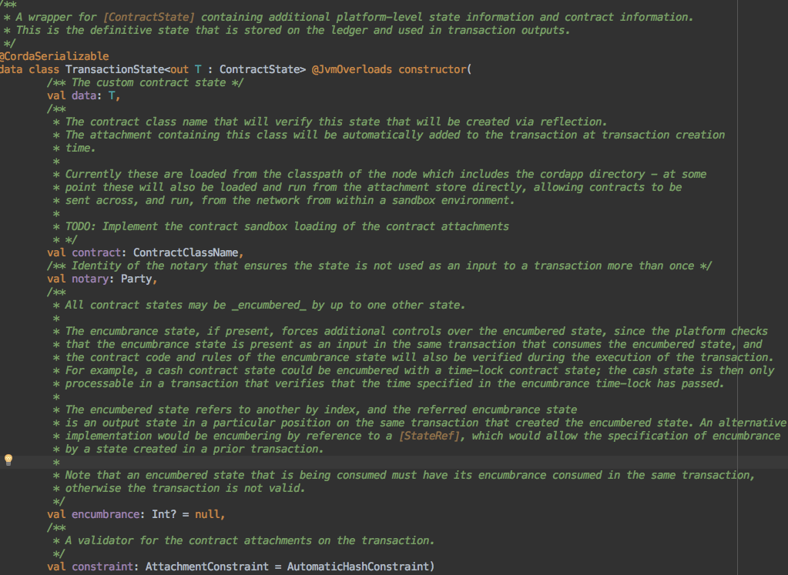

# 5.FLow的使用

### 1.[关于flow](https://docs.corda.net/releases/release-V3.3/api-flows.html) 查看详情

### 2.以下以项目中flow代码为例，示例一

#### 1\)向某一方发起一笔交易，flow作为执行合约的逻辑

```text
@InitiatingFlow(version = 1)
@StartableByRPC
class ApplyForOrderFlow(val otherParty: Party, val orderDetail: PurchaseOrderDetail) : FlowLogic<SignedTransaction>() {

    override val progressTracker = ProgressTracker(Tracker.INITIAL_TRANSACTION, Tracker.VERIFY_TRANSACTION, Tracker.SIGNING_TRANSACTION, Tracker.FINALITY_TRANSACTION)

    @Suspendable
    override fun call(): SignedTransaction {
        progressTracker.currentStep = Tracker.INITIAL_TRANSACTION
        val progress = CommonDataStructurs.progress(ourIdentity.name.organisation, "发起交易","")
        val order = PurchaseOrder(ourIdentity, otherParty, orderDetail, Instant.now(), Common.OrderStatus.APPLY_FOR, progress)

        val txBuilder = TransactionBuilder(serviceHub.networkMapCache.notaryIdentities.first())
                .addOutputState(order, OrderContract.ORDER_CONTRACT_ID)
                .addCommand(OrderContract.Commands.ApplyFor(), ourIdentity.owningKey)
                .setTimeWindow(Instant.now(), Duration.ofSeconds(60))

        progressTracker.currentStep = Tracker.VERIFY_TRANSACTION
        txBuilder.verify(serviceHub)

        progressTracker.currentStep = Tracker.SIGNING_TRANSACTION

        val tx = serviceHub.signInitialTransaction(txBuilder)

        progressTracker.currentStep = Tracker.FINALITY_TRANSACTION

        return subFlow(FinalityFlow(tx))
    }
}
```

说明：

`1）关于注解：@InitiatingFlow(version=1),作用：升级Flow使用，当线上项目出现重要且严重bug定位到flow上，fix bug并同步线上版本（这时flow的版本号不变，自动执行出问题的flow）；向后兼容，自动执行最新flow`

`2)关于注解：@StartableByRPC,作用：通过RPC调用 APplyForOrderFLow`

`3)class: ApplyForOrderFlow(otherParty, orderDetail),前端通过webserver调用RPC传参`

`4）abstract class:返回值FlowLogic<SignedTransaction>，FlowLogic包含所有封装的方法和内部对象的调用`

`5）ProgressTracker:官方文档中是在每个flow中都定义一套ProgressTracker,项目中可以作为公共类定义，其主要目的是跟踪flow的执行步骤,在终端执行flow会打印整个progress的步骤`

`6）order=PurchaseOrder(....)构造函数,作为input`

`7)TransactionBuilder:建造者模式构建，关键的几个方法output,command,详细请查看源码`

`8)关于TimeWindow（时间轴可选）:TransactionBuilder中build timewindow,作用：会检查请求的对方节点是否在线，检测无法通信会自动退出flow，错误提示超时；检测在线执行flow,相当于TCP方式通信,优点：检测对方节点在线的同时有交易有时间限制；如果不使用Timewindow相当于UDP的方式通信，缺点：检测对方节点不在线也会执行成功；`

`9）txBuilder.verify(serviceHub),参见4Contract的使用`

`10）tx:签名交易返回SignTransaction,详情请参见源码`

`11）FinalityFlow: 校验有效的SignTransaction,内部会通过Notary公正签章后将完整的交易数据分发给参与方并存储到数据库中`

`12）subFLow:项目中涉及调用subFlow的是调用第三方库quasar,主要是纤程逐级调用、挂起、返回复杂过程`

### 3.相关扩展

#### 1）WireTransaction和LedgerTransaction

`WireTransaction：包装的是SignTranaction数据，简单理解为签名的数据，详细看源码  
LedgerTransaction: 是WireTransaction的演化，理解为账本数据，详细看源码  
区别：交易中的数据和交易完成的数据`

#### 2）数据组成结构StateAndRef&lt;TransactionState, StateRef&gt;


`StateRef: input data(指向State的引用)  
TransactionState: output data`



### 4.复杂Flow示例二

```text
@InitiatingFlow(version = 1)
@StartableByRPC
class Shipped(val agencyId: String, val signer: Party) : FlowLogic<SignedTransaction>() {

    override val progressTracker: ProgressTracker = ProgressTracker(Tracker.QUERY_AGENCY, Tracker.QUERY_BL, Tracker.QUERY_CLP, Tracker.INITIAL_TRANSACTION, Tracker.VERIFY_TRANSACTION, Tracker.SIGNING_TRANSACTION, Tracker.FINALITY_TRANSACTION)

    @Suspendable
    override fun call(): SignedTransaction {
        progressTracker.currentStep = Tracker.QUERY_AGENCY
        val agency = DAOCriteria(agencyId, serviceHub).queryAgencyById()
        val agencyData = agency.state.data

        progressTracker.currentStep = Tracker.QUERY_BL
        val bl = DAOCriteria(agencyData.orderId, serviceHub).queryBLOrNull()

        progressTracker.currentStep = Tracker.QUERY_CLP
        val clpState = DAOCriteria(agencyData.linearId.id.toString(), serviceHub).queryCLP()

        requireThat {
            "Without permission." using (ourIdentity == agencyData.agency)
            "Bill of Lading has been in existence. " using (bl?.state?.data == null)
            "No signature" using (agencyData.status == Common.ShipStatus.AUDIT_BUREAU)
        }

        val billProgress = CommonDataStructurs.progress(operator = ourIdentity.name.organisation, status_cn = "发送提单", image = "bill_of_lading")
        val billOfLading = BillOfLading(agencyData.orderId, ourIdentity, agencyData.buyer, agencyData.lcDetail.issuingBank, agencyData.seller, agencyData.lcDetail.advisingBank, agencyData.purchaseOrder, ourIdentity, Instant.now(), Instant.now(), Common.BillOfLadingStatus.NON_DELIVERY, billProgress)

        val clpProgress = CommonDataStructurs.progress(ourIdentity.name.organisation, "进口送检", "")
        val clpSignature = SignatureCLPState(clpState.state.data.agencyId, clpState.state.data, ourIdentity, signer, "", Instant.now(), clpProgress)

        val agencyProgress = CommonDataStructurs.progress(operator = ourIdentity.name.organisation, status_cn = "付款", image = "")
        val outputAgency = agencyData.copy(status = Common.ShipStatus.SETTLE_FREIGHT, createTime = Instant.now(), progress = agencyProgress)
//        val outputAgency = agency.state.data.pay()

        progressTracker.currentStep = Tracker.INITIAL_TRANSACTION
        val txBuilder = TransactionBuilder(serviceHub.networkMapCache.notaryIdentities.first())
                .addInputState(agency)
                .addOutputState(billOfLading, BLContract.BL_CONTRACT)
                .addOutputState(outputAgency, AgencyContract.AGENCY_CONTRACT_ID)
                .addOutputState(clpSignature, SignatureCLPContract.SIGNATURE_CLP_CONTRACT_ID)
                .addCommand(BLContract.Commands.CreateAndSend(), ourIdentity.owningKey)
                .addCommand(AgencyContract.Commands.Update(), ourIdentity.owningKey)
                .addCommand(SignatureCLPContract.Commands.CreateRequest(), ourIdentity.owningKey)
                .setTimeWindow(Instant.now(), Duration.ofSeconds(60))


        progressTracker.currentStep = Tracker.VERIFY_TRANSACTION
        txBuilder.verify(serviceHub)

        progressTracker.currentStep = Tracker.SIGNING_TRANSACTION
        val tx = serviceHub.signInitialTransaction(txBuilder)

        progressTracker.currentStep = Tracker.FINALITY_TRANSACTION
        return subFlow(FinalityFlow(tx, Tracker.FINALITY_TRANSACTION.childProgressTracker()))
    }
}
```

说明：区别

`1）加入了数据库的查询`

`2）requireThat{}逻辑校验块`

`3）通过查询获取State,更改input数据，TransactionBuilder里构建了一个InputState,三个OutputState,操作多条账本数据的更新，根据业务需求实现`

`4）其他逻辑和示例一逻辑一样`

### 5.总结

#### 以上都是flow在项目中的用法，这里面没有涉及到对方实时检查的操作（对方响应的操作），请查看官方demo

